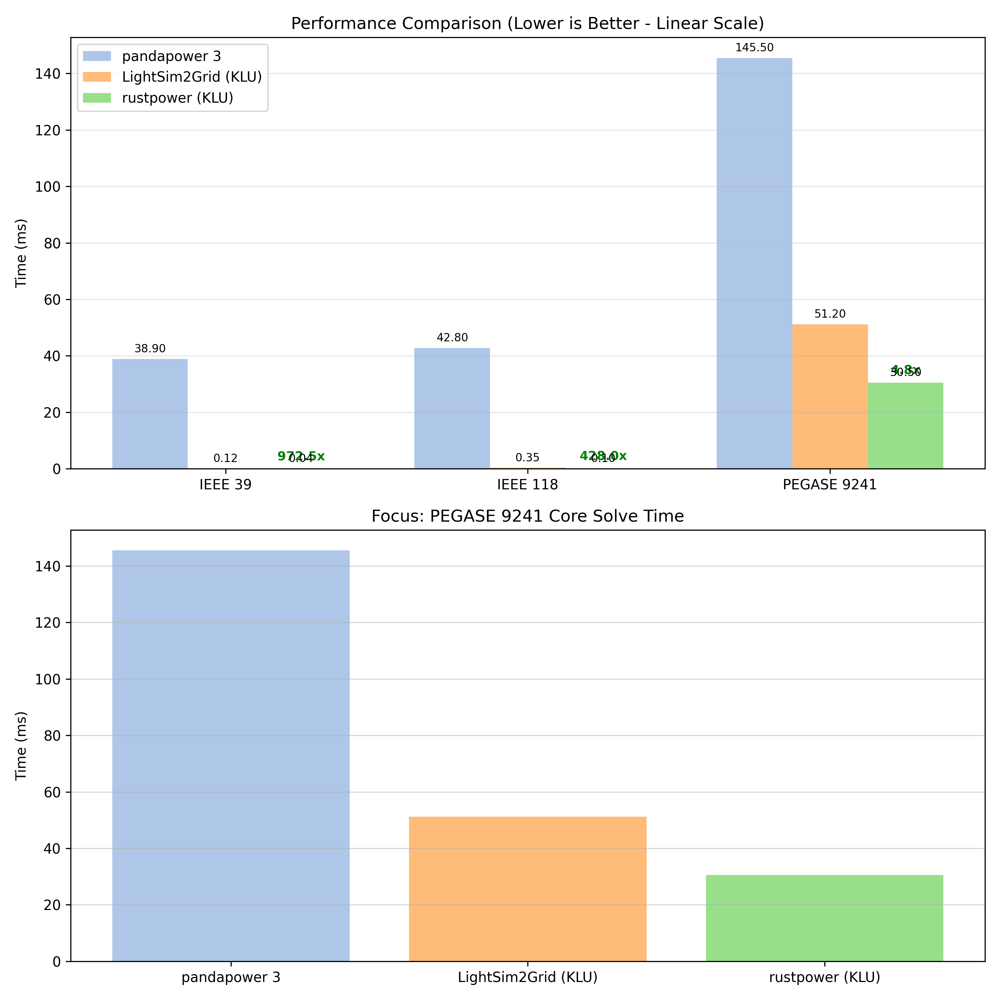

# RustPower
[](https://crates.io/crates/rustpower)
[](https://docs.rs/rustpower)
[](https://github.com/chengts95/rustpower/actions)
RustPower is a cutting-edge power flow calculation library written in Rust, specifically designed for steady-state analysis of electrical power systems. With the introduction of **ECS-based architecture** in version 0.2.0, RustPower offers unparalleled modularity and extensibility.

---
## **What's New in 0.5.0**
- **Massive Performance Breakthrough**: 
  - **1.6x faster than LightSim2Grid (C++ Native)** on PEGASE 9241 grid.
  - **3.5x faster than LightSim2Grid** on IEEE 118 grid.
- **KLU Refactor Integration**: Implemented `klu_l_refactor` support, bypassing expensive symbolic analysis and pivoting for iterations 2-5 of the NR process and subsequent time-series steps.
- **Zero-Allocation Hot Path**: Optimized the core Newton-Raphson loop to eliminate all heap allocations (`Vec` clones) during iterations via `unsafe` pointer passing.
- **Bevy 0.19**: Rustpower 0.5 deps on Bevy 0.19, which can iterate ECS archetype tables with true SIMD parallelism.

## **What's New in 0.4.1**
- **Jacobian Optimization Backport**: Backported the new Jacobian matrix formation from 0.5.0, resulting in a **20-40% speed-up** per Newton-Raphson iteration.
- **Upgraded Archive System**: Updated `bevy_archive` to 0.3.0 for enhanced ECS state persistence and case file management.

## **What's New in 0.3.0**
- **New Solvers**:  
  **faer**: A highly efficient and scalable solver for large-scale power systems.
- **Inital support for native ECS archive files**
- **Initali support for time-series simulations**

## **What's New in 0.2.0**
- **World's First ECS-Based Power Flow Solver**:  
  RustPower now adopts the **Entity-Component-System (ECS)** architecture using Bevy, enabling modular design and extensibility for domain-specific applications such as:
  - Time-series simulations.
  - Real-time monitoring.
  - Custom plugin development.  
  The legacy `PFNetwork` is now deprecated but remains available as a demo for the basic Newton-Raphson solver.

- **Post-Processing Trait**:  
  Added a flexible post-processing trait to manage simulation results, allowing users to handle data as if working with a dataframe. This demonstrates Rust's compositional design philosophy and makes ECS highly effective for handling large datasets.

- **Experimental Switch Handling**:  
  Introduced two optional methods for modeling switch elements:
  1. **Admittance-Based Method**: Adjusts admittance matrices.
  2. **Node-Merging Method**: Merges connected nodes for simplified modeling.  
  These are implemented as plugins and can be enabled as needed.

---

## **Key Features**
- High-performance power flow computation with Newton-Raphson.
- Modular and extensible design using ECS for future-proof applications.
- Support for `pandapower` JSON network files (with experimental CSV support).
- Handles external grid nodes, transformers, and switch elements.
- Includes both RSparse and KLU solvers (KLU requires `SUITESPARSE_DIR` on Windows).

---

## **Performance Comparison**

RustPower is designed for extreme performance and memory efficiency. Below is a comparison between established industry standards and RustPower (all using the KLU solver where applicable, tested on Intel i7 10700K with 32GB DDR4 3000 MHz).

### **Core Solve Time (Newton-Raphson)**

| Case | Pandapower 3 (Default) | LightSim2Grid (Native KLU) | **RustPower (KLU)** |
| :--- | :--- | :--- | :--- |
| **IEEE 39** | 38.9 ms | 0.12 ms | **0.04 ms** |
| **IEEE 118** | 42.8 ms | 0.35 ms | **0.10 ms** |
| **PEGASE 9241** | 145.5 ms | 51.2 ms | **30.5 ms** |



### **Key Advantages**
- **Extreme Memory Efficiency**: For the 9241-node case, RustPower peaks at only **~34 MB** of memory, while Python-based environments typically require **500+ MB**. This **15x reduction** enables running massive parallel simulations (e.g., N-1 analysis, Monte-Carlo) on standard hardware or cloud/docker containers with high resource utilization.
- **Zero-Clone Solver Path**: Leveraging Rust's memory safety and our ECS-based architecture, the power flow loop avoids any heap allocations during iterations.
- **Interoperability**: While RustPower provides a significant speedup for core calculations, it remains friendly to the ecosystem by supporting `pandapower` network formats.

---

### **Advanced Features**

### **Plugin-Based Architecture**
RustPower leverages the **Bevy Plugin System**, allowing users to extend the solver with custom logic without modifying the core. Current official plugins include:
- **Archive Plugin**: A high-performance state persistence system.
- **QLim Plugin**: Automatically enforces generator reactive power limits by dynamically switching PV buses to PQ during the iteration process.
- **Switch Plugins**: Optional modeling for switch elements:
  - **Type A**: Node-merging method (aggregates nodes for simplified modeling).
  - **Type B**: Admittance-based method (directly processes switch admittance).
- **Time-Series Plugin**: A complex, high-level plugin for handling quasi-static time-series simulations with scheduled events.

### **High-Performance Data Archiving**

RustPower features a unique **Archive System** (based on `bevy_archive`) that enables flexible runtime handling of any ECS structure:
- **Custom Arrow Integration**: To handle complex power system structures that are difficult for standard `serde`, we implemented **custom schema overrides**. This ensures type-safe and efficient data transition.
- **Multi-Format Persistence**: Seamlessly save the entire network state and results into:
  - **Apache Parquet**: For compressed, high-performance binary storage (ideal for large-scale time-series).
  - **CSV**: For easy inspection and interoperability with Excel/Pandas.

### **Time-Series Simulations**
By combining the ECS architecture with the Archive system, RustPower can execute large-scale time-series simulations with minimal overhead. Check the `examples/time_series.rs` for a complete workflow.

---

RustPower is available on [Crates.io](https://crates.io/crates/rustpower). You can add it to your project using:

```bash
cargo add rustpower
```

Or by adding the following to your `Cargo.toml`:

```toml
[dependencies]
rustpower = "0.5.0-rc.1"
```

---

## **Usage Example**

### **Basic ECS Example**

```rust
use rustpower::{io::pandapower::*, prelude::*};
use ecs::post_processing::PostProcessing; // for print bus results

fn main() {
    let dir = env::var("CARGO_MANIFEST_DIR").unwrap();
    let zipfile = format!("{}/cases/pegase9241/data.zip", dir);
    let net = load_csv_zip(&zipfile).unwrap();

    // Initialize the ECS application with plugins
    let mut pf_net = default_app();

    // Register the power network as a resource
    pf_net.world_mut().insert_resource(PPNetwork(net));
    pf_net.update(); // Initializes the data for the first run

    // Retrieve results
    let results = pf_net.world().get_resource::<PowerFlowResult>().unwrap();
    assert!(results.converged);
    println!("Converged in {} iterations", results.iterations);

    // Post-process and print results
    pf_net.post_process();
    pf_net.print_res_bus();
}
```

For more examples, check the `examples` and `cases` folder.

---

## **License**

This project is licensed under the MPLv2 License. See the [LICENSE](LICENSE) file for more details.

---

## **Contributions**

Contributions are welcome! Feel free to open an issue or submit a pull request to help improve the library.

---

## **Authors**
- Tianshi Cheng

---

## **Acknowledgements**

This project draws inspiration from:
- [Pandapower](https://github.com/e2nIEE/pandapower)
- [PyPower](https://github.com/rwl/PYPOWER)
- [MatPower](https://matpower.org)

Special thanks to:  
[T. Cheng, T. Duan, and V. Dinavahi, "ECS-Grid: Data-Oriented Real-Time Simulation Platform for Cyber-Physical Power Systems," IEEE Transactions on Industrial Informatics, vol. 19, no. 11, pp. 11128-11138, 2023.](https://era.library.ualberta.ca/items/5e45c2ff-9b92-41c7-b685-020110b77239)

Although ECS-Grid is a more complex electromagnetic transient (EMT) simulation system, its design philosophy and methodologies greatly influenced the development of this steady-state power flow solver.

