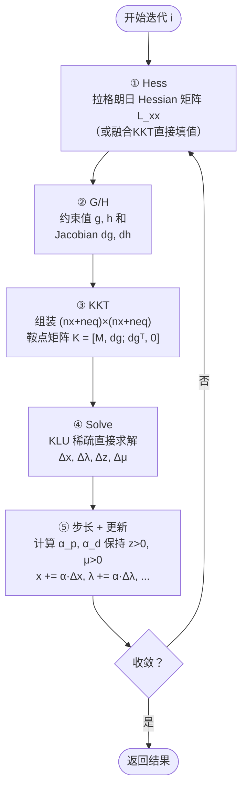
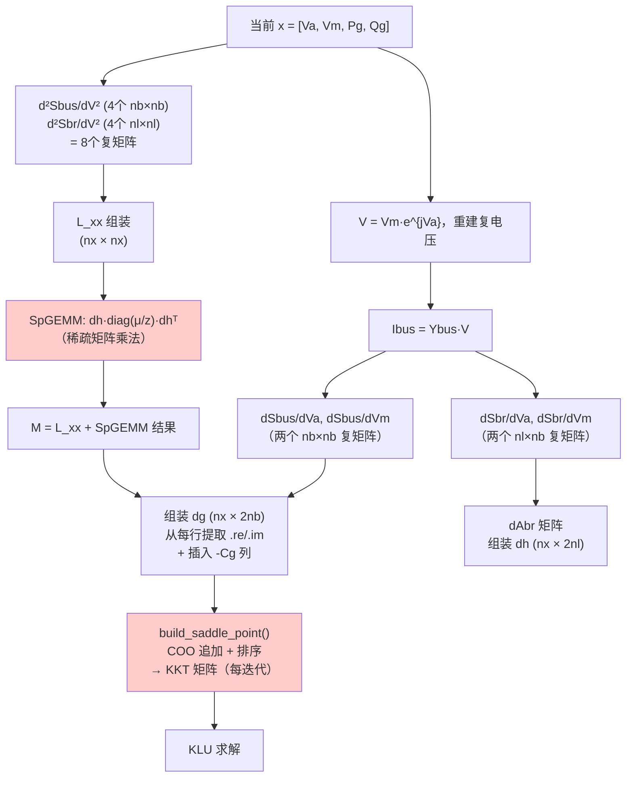
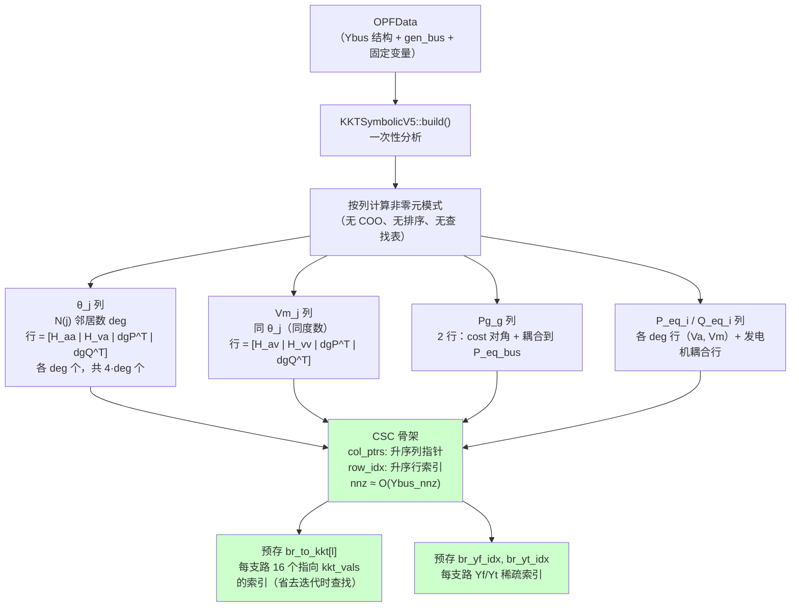
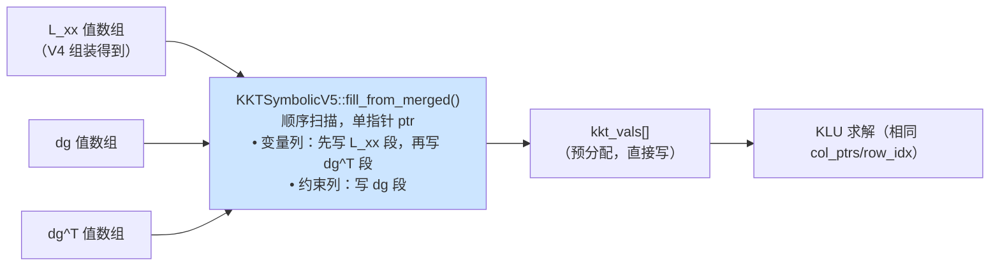
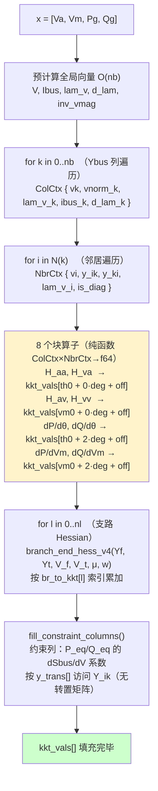
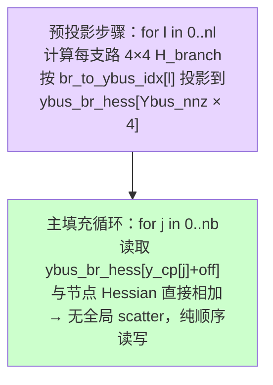
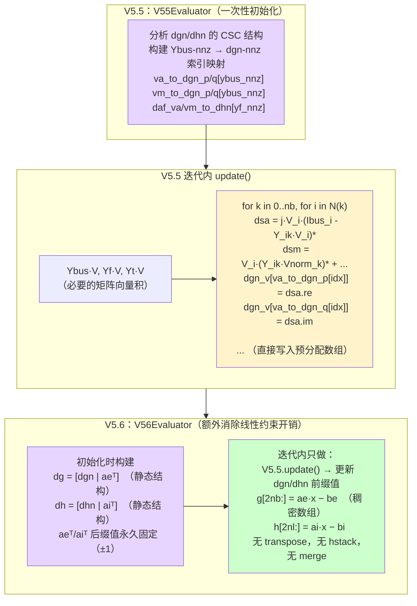
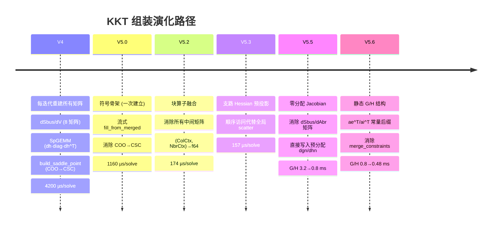

# RustPower OPF 算法设计文档

> 面向读者：熟悉电力系统基础、希望理解代码内部如何工作的研究者/工程师。  
> 测试案例：IEEE118（118母线）；所有性能数据均来自 `cargo run --release --features klu --example v5_compare`。

---

## 目录

1. [问题公式化（OPF）](#1-问题公式化opf)
2. [求解器：内点法 PIPS](#2-求解器内点法-pips)
3. [迭代循环内的五个计算阶段](#3-迭代循环内的五个计算阶段)
4. [代码层次结构](#4-代码层次结构)
5. [KKT 矩阵：从 V4 到 V5.6 的演化](#5-kkt-矩阵从-v4-到-v56-的演化)
6. [关键数据结构](#6-关键数据结构)
7. [实测性能对比](#7-实测性能对比)
8. [各版本改进一览](#8-各版本改进一览)

---

## 1. 问题公式化（OPF）

### 1.1 决策变量

采用 MATPOWER / PYPOWER 的标准变量排列：

```
x = [ Va (nb)  |  Vm (nb)  |  Pg (ng)  |  Qg (ng) ]
       电压相角     电压幅值     有功出力     无功出力
```

其中 `nb` = 母线数，`ng` = 发电机数，`nx = 2·nb + 2·ng`。

### 1.2 目标函数

多项式发电成本（以欧元 / MW 为单位）：

$$f(x) = \sum_{g=1}^{n_g} \left[ c_{2,g} \cdot (P_{g} \cdot S_{base})^2 + c_{1,g} \cdot P_{g} \cdot S_{base} + c_{0,g} \right]$$

代码位置：[`src/opf/cost.rs`](../src/opf/cost.rs)

### 1.3 等式约束 g(x) = 0（功率平衡）

$$g(x) = \begin{bmatrix} \text{Re}(V \odot \overline{Y_{bus} V}) - C_g P_g + P_d \\ \text{Im}(V \odot \overline{Y_{bus} V}) - C_g Q_g + Q_d \end{bmatrix} \in \mathbb{R}^{2n_b}$$

即每条母线的 P / Q 注入平衡误差（功率潮流方程残差）。

### 1.4 不等式约束 h(x) ≤ 0（支路潮流限制）

$$h_l = |S_{f,l}|^2 - S_{max,l}^2 \leq 0, \quad h_{n_l + l} = |S_{t,l}|^2 - S_{max,l}^2 \leq 0$$

每条支路两端的视在功率平方限制（共 `2·nl` 个不等式）。

代码位置：[`src/opf/constraints.rs`](../src/opf/constraints.rs)

### 1.5 变量界

- 电压幅值上下界：`Vm_min ≤ Vm ≤ Vm_max`
- 有功/无功出力界：`Pg_min ≤ Pg ≤ Pg_max`，`Qg_min ≤ Qg ≤ Qg_max`
- 参考母线相角固定：`Va_ref = 0`（等式约束 `xmin == xmax`）

---

## 2. 求解器：内点法 PIPS

PIPS（Predictor-Corrector Interior-Point Solver）是对原始-对偶内点法的一种实现，其标准形式为：

$$\min f(x) \quad \text{s.t.} \quad g(x)=0,\ h(x)\leq 0,\ x_{min}\leq x\leq x_{max}$$

引入松弛变量 `z`（`h(x) + z = 0, z > 0`）和对偶变量 `λ`（等式）、`μ`（不等式），形成扩展拉格朗日：

$$L = f + \lambda^T g + \mu^T h$$

**收敛判据**（均需同时满足）：

| 条件 | 含义 | 阈值 |
|---|---|---|
| `feascond` | 约束可行性（g、h 残差） | 1e-6 |
| `gradcond` | 梯度条件（KKT 梯度） | 1e-6 |
| `compcond` | 互补松弛 `z·μ` | 1e-6 |
| `costcond` | 目标函数变化率 | 1e-6 |

代码位置：[`src/opf/pips.rs`](../src/opf/pips.rs)

---

## 3. 迭代循环内的五个计算阶段

每次 PIPS 迭代均分为五个有独立计时的阶段：



### 各阶段对总时间的贡献（IEEE118，V4 基线）

```
Hess   660 µs   (5.4%)   ← 拉格朗日 Hessian 组装
G/H   3210 µs  (26.3%)   ← 约束 + Jacobian 计算
KKT   4200 µs  (34.5%)   ← 鞍点矩阵组装（最大瓶颈）
Solv  4120 µs  (33.8%)   ← KLU 稀疏直接求解
────────────────────────
合计 12190 µs
```

---

## 4. 代码层次结构

```mermaid
flowchart LR
    subgraph IO["数据输入层"]
        PD["pandapower CSV/ZIP\nNetwork"]
        BUILDER["opf_data_from_network\nsrc/opf/builder.rs"]
        PD --> BUILDER
    end

    subgraph DATA["问题数据"]
        OPF["OPFData\nsrc/opf/problem.rs\n• Ybus, Yf, Yt\n• gen_bus, cost_coeffs\n• rate_a, bounds"]
        WX["warm_x0()\n先跑 NR 潮流\n用作 OPF 暖启动"]
        BUILDER --> OPF
        OPF --> WX
    end

    subgraph PIPS_LAYER["PIPS 求解层（src/opf/pips.rs）"]
        P1["pips()\nV4 路径（基线）"]
        P2["pips_with_solver()\n+ V5.0 流式 KKT 填充"]
        P3["pips_with_fused_assembly()\nV5.2/V5.3 融合组装"]
        P4["pips_with_fused_assembly_v55()\n零分配 Jacobian"]
        P5["pips_with_fused_assembly_v56()\n线性约束直接填充"]
    end

    subgraph KERNEL["计算内核（src/new_opf/）"]
        V4K["v4_numeric_rect.rs\n矩形-极坐标融合\nHessian 直接写入 lxx"]
        V52K["v5_2_kernel.rs\n块算子 KKT\n(ColCtx, NbrCtx) → f64"]
        V53K["v5_3_kernel.rs\n分区同构组装\n支路 Hessian 预投影到 Ybus"]
        V55E["v5_5_evaluator.rs\nJacobian 直接填充\n无中间矩阵"]
        V56E["v5_6_evaluator.rs\n线性约束静态结构\n迭代只更新值数组"]
        SYM["v5_kkt.rs\nKKTSymbolicV5\n仅构建一次 CSC 骨架"]
    end

    subgraph SOLVER["线性求解器"]
        KLU["DefaultSolver (KLU)\ncrates/rustpower-sol-klu"]
    end

    DATA --> PIPS_LAYER
    PIPS_LAYER --> KERNEL
    PIPS_LAYER --> SOLVER
    KERNEL --> SOLVER
```



---

## 5. KKT 矩阵：从 V4 到 V5.6 的演化

KKT 鞍点矩阵的结构为：

$$K = \begin{bmatrix} M & dg \\ dg^T & 0 \end{bmatrix}, \quad \dim = (n_x + n_{eq}) \times (n_x + n_{eq})$$

其中 $M = L_{xx} + \text{Merged Slack Penalty}$（对角化的不等式松弛项）。

**KKT 矩阵的稀疏结构**完全由 Ybus 拓扑决定，与迭代次数无关——这是整个 V5 优化的核心洞察。

### 5.1 V4：基线路径（每迭代重建所有矩阵）



**V4 瓶颈**：每迭代做一次 SpGEMM（`dh·diag·dhᵀ`）+ `build_saddle_point`（COO→CSC + 排序），合计 **4.2 ms / 14 迭代**。

---

### 5.2 V5 符号骨架（一次性构建）

**核心洞察**：KKT 的非零元位置（稀疏结构）由 Ybus 拓扑决定，与 x、λ、μ 无关。因此只需在求解开始前构建一次 CSC 骨架（`col_ptrs`, `row_idx`），迭代中只更新 `values` 数组。



代码位置：[`src/new_opf/v5_kkt.rs`](../src/new_opf/v5_kkt.rs)

---

### 5.3 V5.0：流式数值填充

有了符号骨架后，V5.0 仍沿用 V4 的 L_xx 和 dg 矩阵，但用一个**单一前向指针流**替换 `build_saddle_point`：



**V5.0 消除了**：COO 追加、排序、`build_saddle_point` 中的 COO→CSC 转换。  
KKT 阶段耗时：**4.20 ms → 1.16 ms（3.6×）**。

---

### 5.4 V5.2：块算子融合（无中间矩阵）

V5.2 彻底消除 `L_xx`、`dg`、`dg^T` 矩阵。所有 Hessian / Jacobian 值**直接计算并写入** `kkt_vals`。



**V5.2 消除了**：所有中间矩阵（无 `lxx`、无 `dg`、无 `dg^T`、无 SpGEMM）。  
KKT 阶段耗时：**1.16 ms → 174 µs（6.7×）**。

---

### 5.5 V5.3：支路 Hessian 预投影（分区同构）

V5.3 在 V5.2 基础上进一步优化支路 Hessian 的内存访问模式：



**原理**：支路 Hessian 与 Ybus 具有同构拓扑结构——每条支路的 4 个 (f,t) 节点对正好对应 Ybus 中的 4 个非零元位置。预投影后主循环变为纯顺序访问，对大规模（pegase9241 级别）缓存友好性显著提升。

---

### 5.6 V5.5 / V5.6：零分配 Jacobian + 静态 G/H 结构



**V5.5 消除了**：`dSbus_dVa`、`dSbus_dVm`、`dAbr` 等中间矩阵的构造。  
**V5.6 额外消除了**：`merge_constraints`、`transpose(ai)`、`hstack_csc` 的每迭代调用。  
G/H 阶段耗时：**3.21 ms → 477 µs（6.7×）**。

---

## 6. 关键数据结构

### 6.1 OPFData（问题数据，`src/opf/problem.rs`）

| 字段 | 类型 | 含义 |
|---|---|---|
| `ybus` | `CscMatrix<Complex64>` | 节点导纳矩阵（nb×nb） |
| `yf`, `yt` | `CscMatrix<Complex64>` | 支路首/末端导纳（nl×nb） |
| `f_buses`, `t_buses` | `Vec<usize>` | 支路首/末端母线索引 |
| `cg` | `CscMatrix<f64>` | 发电机-母线关联矩阵（nb×ng） |
| `cost_coeffs` | `Vec<[f64;3]>` | 每台发电机 [c2, c1, c0] |
| `rate_a` | `Vec<f64>` | 支路视在功率限制 [p.u.] |

### 6.2 KKTSymbolicV5（符号骨架，`src/new_opf/v5_kkt.rs`）

| 字段 | 类型 | 含义 |
|---|---|---|
| `col_ptrs` | `Vec<usize>` | KKT CSC 列指针（维度 dim+1） |
| `row_idx` | `Vec<usize>` | KKT CSC 行索引（维度 nnz） |
| `br_to_kkt` | `Vec<[usize;16]>` | 每支路 → kkt_vals 中 4×4 块的 16 个索引 |
| `br_yf_idx` | `Vec<[usize;2]>` | 预存 Yf 每行的稀疏索引 |
| `gens_at_bus` | `Vec<Vec<usize>>` | 每母线上的发电机列表 |
| `ieq` | `Vec<usize>` | 固定变量索引（Va_ref 等） |

### 6.3 各版本求解器入口对照

| 调用函数 | 路径 | 内核组合 |
|---|---|---|
| `pips()` | `new_opf/pips.rs` | V4 rect fill + build_saddle_point |
| `pips_v5()` | 同上 | V4 rect fill + V5.0 流式 fill |
| `pips_v5_2()` | 同上 | V5.2 块算子（fused_assembly） |
| `pips_v5_3()` | 同上 | V5.3 分区同构（fused_assembly） |
| `pips_v5_5()` | 同上 | V5.3 KKT + V5.5 零分配 Jacobian |
| `pips_v5_6()` | 同上 | V5.3 KKT + V5.6 静态 G/H |

---

## 7. 实测性能对比

**测试条件**：IEEE118，warm start，14 PIPS 迭代，KLU 求解器，`--release`。  
数值均为 14 次迭代的**总耗时**。

| 版本 | Hess | G/H | KKT | Solv (KLU) | **组装合计¹** | **端到端** |
|:---|---:|---:|---:|---:|---:|---:|
| **V4**（基线） | 660 µs | 3210 µs | 4200 µs | 4120 µs | **8070 µs** | **12190 µs** |
| V5.0 流式 KKT | 565 µs | 3580 µs | 1160 µs | 4460 µs | 5305 µs | 9765 µs |
| V5.2 块算子 | 655 µs | 2535 µs | 174 µs | 3503 µs | 3364 µs | 6867 µs |
| V5.3 分区同构 | 778 µs | 3004 µs | 157 µs | 3695 µs | 3939 µs | 7634 µs |
| V5.5 零分配 J | 687 µs | 817 µs | 153 µs | 3472 µs | **1657 µs** | 5129 µs |
| **V5.6** 静态G/H | 696 µs | 477 µs | 145 µs | 3458 µs | **1318 µs** | **4778 µs** |

¹ 组装合计 = Hess + G/H + KKT（RustPower 控制的部分；Solv 为外部 KLU）

**各阶段加速比（V4 → V5.6）**：

```
KKT 组装：4200 → 145 µs  = 29×  （消除 SpGEMM + COO→CSC）
G/H 计算：3210 → 477 µs  =  6.7× （消除中间矩阵 + 静态结构）
Hess：      660 → 696 µs  ≈ 持平   （已是 V4 瓶颈以外）
Solv：     4120 → 3458 µs ≈ 持平   （持久化 KLU，由外部库决定）

组装合计：8070 → 1318 µs = 6.1×
端到端：  12190 → 4778 µs = 2.55×
```

### 当前瓶颈

V5.6 的 `Solv` 占端到端总时间的 **72%**（3458/4778），而 V4 时仅占 **34%**。意味着进一步的 OPF 性能提升需要针对线性求解器（KLU 并行化、超节点重排序），而非 KKT 组装。

---

## 8. 各版本改进一览



### 关键设计原则总结

1. **分离符号与数值**：KKT 的稀疏结构（由 Ybus 拓扑决定）只分析一次，数值每迭代覆写。
2. **流式写入**：所有数值按 CSC 列顺序单向写入，避免随机访问和 scatter。
3. **消除分配**：所有性能关键路径的 `Vec` 只分配一次（初始化时），迭代中只改写 `&mut [f64]`。
4. **拓扑同构利用**：支路 Hessian、Jacobian 与 Ybus 结构同构，可以直接用 Ybus 的 nnz 索引寻址，无需额外查找表。
5. **暖启动**：先做 NR 潮流得到 Va/Vm 初值，OPF 典型 14 迭代收敛（无暖启动约 20-30 迭代）。

---

*文档由代码自动分析生成，对应 commit `02985b5`（`opf_exp` 分支）。*
